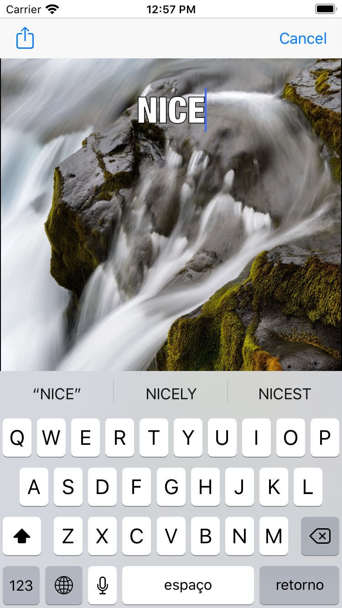

# MemeMe

Second and third projects of [Udacity's iOS Developer Nanodegree](https://www.udacity.com/course/ios-developer-nanodegree--nd003). 

It's a 2-part app where the first one will allow users to create memes from images from device's camera or album and share them.

To acomplish that it was required:

- `UIImagePickerController` to get images from device's album.
- `AVCaptureDevice` to get images from device's camera (when available).
- Subscription to `NotificationCenter` to observe showing/hidden events from keyboard to avoid bottom label being overlaped by it. 
- `view.drawHierarchy()` and `CGImage.cropping()` to capture screen and crop meme area.
- `UIActivityViewController` to share or locally save the generated images.

**Screenshots (part 1):**

<table align="center">
  <tr>
     <td>
       
       
Main screen

     </td>
     <td>
       
       
Label editing

     </td>
  </tr>
  <tr>
     <td>
       
       
Meme sharing

     </td>
     <td>
       
       
Meme saved

     </td>
  </tr>
</table>

In the second part it was added a tab bar navigation as an initial view that shows sent memes and users can see them as a list or a collection (grid). It's still possible to create new memes as the previous version and edit current ones that will be saved as new memes. 

**Screenshots (part 2):**

<table align="center">
  <tr>
     <td>
       
       
Main screen with sent memes in tab view

     </td>
     <td>
       
       
Main screen with sent memes in grid view

     </td>
  </tr>
  <tr>
     <td>
       
       
Selected meme screen

     </td>
     <td>
       
       
Edit screen

     </td>
  </tr>
  <tr>
     <td>
       
       
Updated grid view in main screen

     </td>
     <td>
       
       
Create new meme screen

     </td>
  </tr>
</table>

## Installation

Clone this repository, import into [Xcode](https://developer.apple.com/xcode/) and build it with simulator.

## Copyright

Project developed by Márcio Souza de Oliveira.
